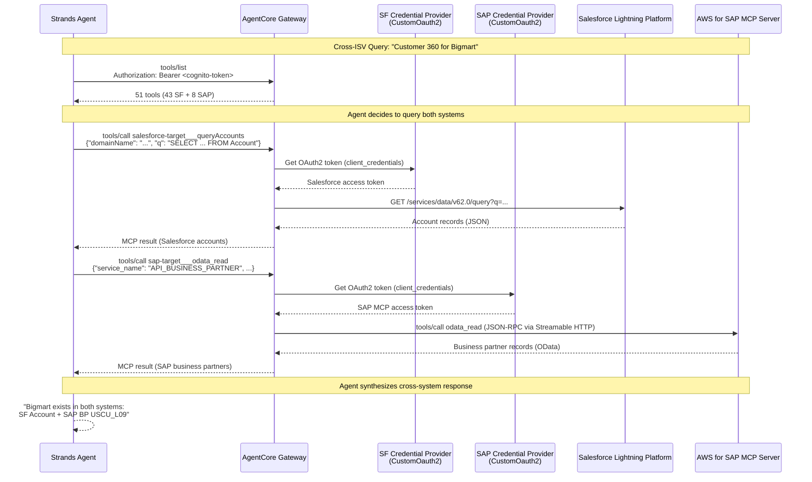

```mermaid
sequenceDiagram
    participant Agent as Strands Agent
    participant Gateway as AgentCore Gateway
    participant SFCred as SF Credential Provider<br/>(CustomOauth2)
    participant SAPCred as SAP Credential Provider<br/>(CustomOauth2)
    participant SF as Salesforce Lightning Platform
    participant SAP as AWS for SAP MCP Server

    Note over Agent, SAP: Cross-ISV Query: "Customer 360 for Bigmart"

    Agent->>Gateway: tools/list<br/>Authorization: Bearer <cognito-token>
    Gateway-->>Agent: 51 tools (43 SF + 8 SAP)

    Note over Agent, SAP: Agent decides to query both systems

    Agent->>Gateway: tools/call salesforce-target___queryAccounts<br/>{"domainName": "...", "q": "SELECT ... FROM Account"}
    Gateway->>SFCred: Get OAuth2 token (client_credentials)
    SFCred-->>Gateway: Salesforce access token
    Gateway->>SF: GET /services/data/v62.0/query?q=...
    SF-->>Gateway: Account records (JSON)
    Gateway-->>Agent: MCP result (Salesforce accounts)

    Agent->>Gateway: tools/call sap-target___odata_read<br/>{"service_name": "API_BUSINESS_PARTNER", ...}
    Gateway->>SAPCred: Get OAuth2 token (client_credentials)
    SAPCred-->>Gateway: SAP MCP access token
    Gateway->>SAP: tools/call odata_read (JSON-RPC via Streamable HTTP)
    SAP-->>Gateway: Business partner records (OData)
    Gateway-->>Agent: MCP result (SAP business partners)

    Note over Agent, SAP: Agent synthesizes cross-system response
    Agent-->>Agent: "Bigmart exists in both systems:<br/>SF Account + SAP BP USCU_L09"
```
