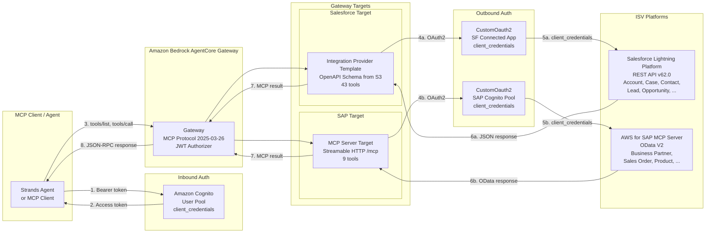

```mermaid
flowchart LR
    subgraph Client["MCP Client / Agent"]
        A[Strands Agent<br/>or MCP Client]
    end

    subgraph Auth["Inbound Auth"]
        B[Amazon Cognito<br/>User Pool<br/>client_credentials]
    end

    subgraph Gateway["Amazon Bedrock AgentCore Gateway"]
        C[Gateway<br/>MCP Protocol 2025-03-26<br/>JWT Authorizer]
    end

    subgraph Targets["Gateway Targets"]
        subgraph SF["Salesforce Target"]
            D[Integration Provider Template<br/>OpenAPI Schema from S3<br/>43 tools]
        end
        subgraph SAP["SAP Target"]
            E[MCP Server Target<br/>Streamable HTTP /mcp<br/>9 tools]
        end
    end

    subgraph OutAuth["Outbound Auth"]
        F[CustomOauth2<br/>SF Connected App<br/>client_credentials]
        G[CustomOauth2<br/>SAP Cognito Pool<br/>client_credentials]
    end

    subgraph ISV["ISV Platforms"]
        H[Salesforce Lightning Platform<br/>REST API v62.0<br/>Account, Case, Contact,<br/>Lead, Opportunity, ...]
        I[AWS for SAP MCP Server<br/>OData V2<br/>Business Partner,<br/>Sales Order, Product, ...]
    end

    A -->|"1. Bearer token"| B
    B -->|"2. Access token"| A
    A -->|"3. tools/list, tools/call"| C
    C --> D
    C --> E
    D -->|"4a. OAuth2"| F
    E -->|"4b. OAuth2"| G
    F -->|"5a. client_credentials"| H
    G -->|"5b. client_credentials"| I
    H -->|"6a. JSON response"| D
    I -->|"6b. OData response"| E
    D -->|"7. MCP result"| C
    E -->|"7. MCP result"| C
    C -->|"8. JSON-RPC response"| A
```
